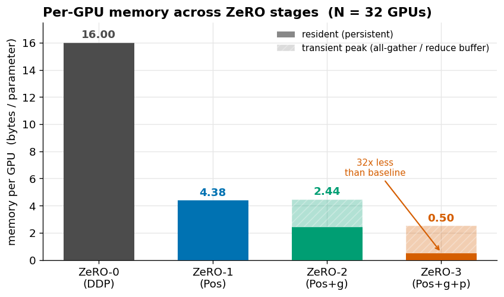
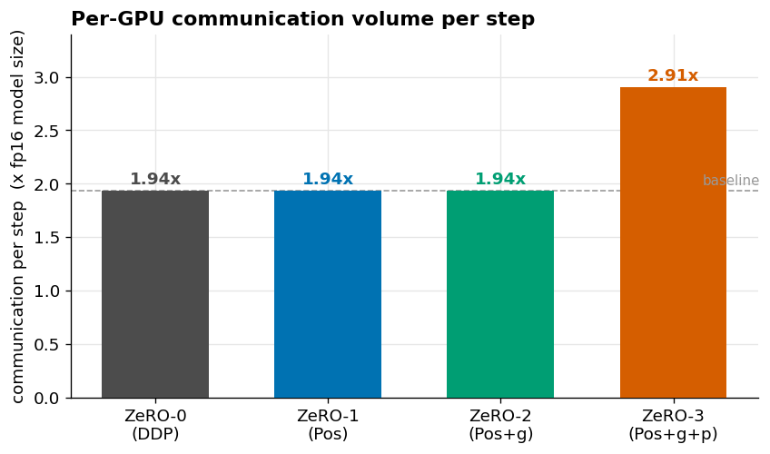
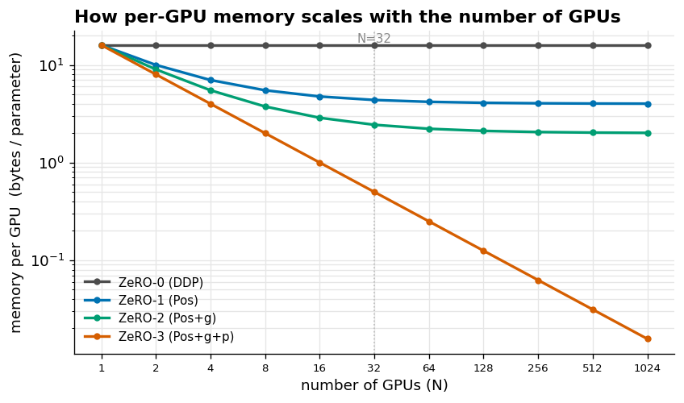

# Simulating ZeRO (ZeRO-0/1/2/3) on 32 Virtual GPUs — from scratch

**Assignment 12** — build 32 virtual GPUs, run a demo model on them, and simulate
the ZeRO memory-optimization stages (ZeRO-0/1/2/3) to show how **memory** and
**computation/communication** change.

This repository implements everything by hand — no DeepSpeed, no FSDP calls doing
the work for me. The virtual GPUs are plain Python objects driven by CPU threads,
each carrying a **byte-accurate memory ledger** and a **communication ledger**, so
every number reported below is *measured from real array allocations*, not printed
from a formula. A PyTorch section then reproduces the same accounting on real
`torch` tensors with real autograd gradients.

---

## 🔴 Live interactive widget (Netlify)

An interactive **ZeRO Memory Explorer** ships in [`widget/`](widget/index.html): pick a
model size (125M → 175B), a GPU count, an optimizer and a precision, and watch the
per-GPU memory, the params/grads/optimizer breakdown, the communication volume, and
the `1/N` scaling curve update live — plus a "does it fit on an 80 GB GPU?" check.
It's a single self-contained `index.html` (no build step, no dependencies).

The widget has two modes, toggled at the top:

- **Measured · simulation** (default) — reads the numbers the from-scratch simulation
  actually produced, exported to [`widget/data/measurements.json`](widget/data/measurements.json)
  by the notebook's export cell. These carry the real ring-factor communication
  (e.g. 1.94Ψ, not 2Ψ, at N=32) and the transient all-gather/reduce peaks.
- **Analytic · formula** — the idealized ZeRO memory/communication formula, exact in
  the large-model limit, with every optimizer and precision unlocked to explore.

**Live demo:** _<add your Netlify URL here after deploying, e.g. `https://zero-explorer.netlify.app`>_

**Deploy it (30 seconds):**

- **Drag-and-drop:** open <https://app.netlify.com/drop> and drag the `widget/` folder onto it.
- **Git-connected:** on Netlify choose *Add new site → Import from Git*, pick this repo, and
  keep the defaults — [`netlify.toml`](netlify.toml) already sets `publish = "widget"`, so
  every push redeploys the widget automatically.

Screenshot of the explorer (6.7B model, N=32, Adam): ZeRO-0 needs **107 GB/GPU** and
does *not* fit an 80 GB card, while ZeRO-3 needs **3.35 GB/GPU** and fits comfortably —
the whole argument for ZeRO in one glance.

---

## TL;DR — what ZeRO does and what it costs

ZeRO ("Zero Redundancy Optimizer", from Microsoft's DeepSpeed) attacks the fact
that ordinary data parallelism keeps **N identical copies** of the model,
gradients, and optimizer state — one full copy per GPU. That is enormously
wasteful, because each GPU only ever needs the optimizer state for the parameters
*it* will update. ZeRO **partitions** these tensors across the N GPUs instead of
replicating them, and rebuilds each piece only for the moment it is needed.

For mixed-precision Adam, memory per parameter breaks down as **16 bytes**:

| item | precision | bytes/param |
|---|---|:--:|
| parameters (compute copy) | fp16 | 2 |
| gradients | fp16 | 2 |
| optimizer — fp32 master weights | fp32 | 4 |
| optimizer — Adam momentum `m` | fp32 | 4 |
| optimizer — Adam variance `v` | fp32 | 4 |
| **total** | | **16** |

The optimizer states are `12` of those `16` bytes — **75% of memory is pure
redundancy** in data parallelism. Each ZeRO stage partitions one more thing:

| stage | partitions | memory/param (N GPUs) | @ N=32 | comm/step |
|---|---|:--:|:--:|:--:|
| **ZeRO-0** (DDP) | nothing | `16` | 16.0 | `2Ψ` |
| **ZeRO-1** (P_os) | optimizer states | `4 + 12/N` | 4.375 | `2Ψ` |
| **ZeRO-2** (P_os+g) | + gradients | `2 + 14/N` | 2.438 | `2Ψ` |
| **ZeRO-3** (P_os+g+p) | + parameters | `16/N` | 0.500 | `3Ψ` |

(`Ψ` = the fp16 model size = one full copy of the parameters.)

**The three things that matter:** ZeRO-1 and ZeRO-2 cut memory 3.7×/6.6× **for
free** — identical communication to plain DDP. ZeRO-3 cuts memory **32×** (it
scales as `1/N`) at the cost of **1.5× communication**. And the model's actual
FLOPs never change — ZeRO trades **communication and a bit of recompute for
memory**, it does not split the math of a layer.

---

## Results (all measured by the code in this repo)

**Correctness first.** Every ZeRO stage must train the *identical* model as the
baseline — partitioning changes only where data lives, never the arithmetic. Both
the NumPy and the PyTorch implementations confirm this exactly:

```
Correctness check — every stage vs the ZeRO-0 baseline:
stage                        max|Δparam|    max|Δloss|   status
ZeRO-1 (Pos)                    0.00e+00      0.00e+00   IDENTICAL ✓
ZeRO-2 (Pos+g)                  0.00e+00      0.00e+00   IDENTICAL ✓
ZeRO-3 (Pos+g+p)                0.00e+00      0.00e+00   IDENTICAL ✓
```

### Memory per GPU



Solid bars are the resident (persistent) footprint — the ZeRO table exactly:
16 → 4.38 → 2.44 → 0.50 bytes/param. The hatched caps on ZeRO-2/3 are the honest
transient peak: to reduce-scatter or all-gather you briefly rebuild a full-size
buffer, so peak memory is above the resident footprint. (Real frameworks shrink
this by gathering one layer/bucket at a time; this flat model gathers the whole
vector, i.e. the worst case.)

### Communication per step



Measured ≈1.94 instead of 2.0 because of the ring-algorithm factor
`(N−1)/N = 31/32 = 0.969`. ZeRO-1/2 match baseline; ZeRO-3 is 1.5×.

### How memory scales with N



ZeRO-0 is flat — adding GPUs never helps per-GPU memory (the core problem).
ZeRO-1/2 flatten toward their un-shardable residue. **Only ZeRO-3 keeps falling
like `16Ψ/N`**, which is exactly why it is used to train models too large to fit
on a single device.

---

## What I understood by building this (not my agent)

I wrote this so the concepts are demonstrated by construction, not asserted:

1. **Where the memory goes.** Adam's optimizer state (`12` of `16` bytes/param) is
   the dominant cost and is replicated N times for no reason in DDP. That
   redundancy is precisely what ZeRO removes — the memory table falls straight out
   of counting `.nbytes` of the arrays each stage actually keeps
   (`build_layout` in the notebook).

2. **Why partitioning is numerically free.** Adam is *elementwise* and gradients
   *sum linearly across the data-parallel micro-batches*. So updating a shard of
   the weights with the corresponding shard of the summed gradient gives bit-for-bit
   the same result as the replicated update. I prove this two ways — my NumPy Adam
   sharded 32 ways vs the baseline (`max|Δparam| = 0`), and `torch.optim.Adam` run
   independently on 32 `torch.chunk` shards vs on the whole vector (`0.00e+00`).

3. **The memory↔communication trade.** I implemented the three collectives
   (`all_reduce`, `reduce_scatter`, `all_gather`) and charged each with the ring
   cost model. That reproduces the paper's `2Ψ / 2Ψ / 2Ψ / 3Ψ` table: ZeRO-1/2 are
   free wins; ZeRO-3 spends an extra parameter all-gather in the forward *and* in
   the backward to make weights shardable.

4. **Compute is untouched.** Each virtual GPU runs exactly one forward+backward on
   its micro-batch in every stage — same FLOPs. ZeRO gives model-parallel-sized
   memory savings *without* splitting a layer's math across devices.

### The stages, precisely

- **ZeRO-1 (P_os):** shard optimizer states only. Params + grads stay full (`2Ψ +
  2Ψ`), optimizer becomes `12Ψ/N`. Gradients are reduce-scattered so each GPU
  updates its own shard, then updated params are all-gathered → `2Ψ` comm, same as
  DDP.
- **ZeRO-2 (P_os+g):** also keep only your **shard** of the gradient after
  reduction, dropping grads from `2Ψ` to `2Ψ/N`. Communication is unchanged.
- **ZeRO-3 (P_os+g+p):** parameters are sharded too. The full weights of a layer
  are all-gathered just in time for its forward and again for its backward, then
  discarded → everything is `16Ψ/N`, at `3Ψ` communication.

### Honest limitations of the simulation

These are 32 *logical* GPUs on one machine, so communication is **accounted** with
the ring cost model rather than actually sent over a network — there is no
bandwidth/latency and wall-clock time is not representative of a real cluster. The
transient peaks are worst-case because the flat model gathers the entire
parameter/gradient vector at once; production ZeRO gathers layer-by-layer
(bucketed) and can offload shards to CPU/NVMe (ZeRO-Infinity). What *is* faithful
is the memory and communication accounting — the reason DeepSpeed and PyTorch FSDP
exist.

---

## Repository layout

```
zero-simulation/
├── zero_from_scratch.ipynb   # ← main deliverable: self-contained, runs top-to-bottom
├── README.md                 # this file
├── widget/
│   └── index.html            # interactive ZeRO Memory Explorer (deploy to Netlify)
├── netlify.toml              # Netlify config (publish = "widget")
├── zero_sim.py               # the simulation as an importable module (VirtualGPU, model, collectives)
├── zero_stages.py            # per-stage layout + training step (ZeRO-0/1/2/3)
├── torch_demo.py             # the PyTorch companion, standalone
├── make_figures.py           # regenerates figures/*.png
├── test_sim.py               # correctness + memory + comm checks (prints the tables)
├── figures/                  # memory.png, comm.png, scaling.png, loss.png
├── requirements.txt
└── LICENSE
```

The notebook is fully self-contained (all classes are defined in-cell); the `.py`
files are the same logic packaged as a module for anyone who prefers to `import` it
or run the checks from the command line.

## Running it

```bash
pip install -r requirements.txt

# option A: open the notebook (Jupyter or Colab) and Run All
jupyter notebook zero_from_scratch.ipynb

# option B: run the checks from the terminal
python test_sim.py       # prints correctness + memory + communication tables
python torch_demo.py     # the PyTorch version
python make_figures.py   # regenerate the figures
```

Runs on CPU in a few seconds — no GPU required. Tested with Python 3.11+, NumPy 2.x,
PyTorch 2.x.

## References

- Rajbhandari, Rasley, Ruwase, He. *ZeRO: Memory Optimizations Toward Training
  Trillion Parameter Models* (SC 2020) — the `16` bytes/param budget and the
  `2Ψ/2Ψ/2Ψ/3Ψ` communication analysis this repo reproduces.
- PyTorch `ZeroRedundancyOptimizer` (ZeRO-1) and `FullyShardedDataParallel` /
  FSDP (ZeRO-3).
